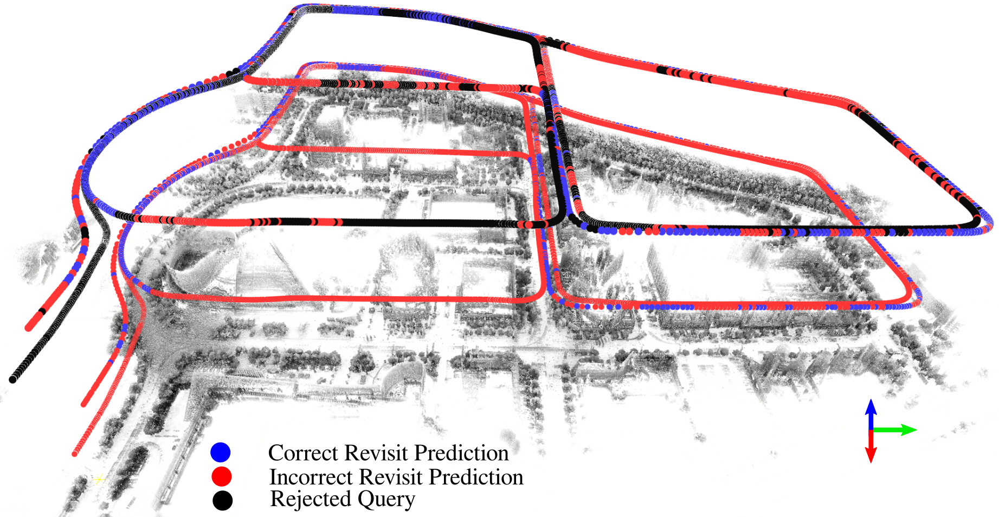

# Uncertainty-Aware Lidar Place Recognition in Novel Environments

This repository contains the code implementation used in the paper [Uncertainty-Aware Lidar Place Recognition in Novel Environments](https://arxiv.org/pdf/2210.01361.pdf) (accepted at IROS2023) [[arXiv]](https://arxiv.org/pdf/2210.01361.pdf).



## Abstract

State-of-the-art lidar place recognition models exhibit unreliable performance when tested on environments different from their training dataset, which limits their use in complex and evolving environments. To address this issue, we investigate the task of uncertainty-aware lidar place recognition, where each predicted place must have an associated uncertainty that can be used to identify and reject incorrect predictions. We introduce a novel evaluation protocol and present the first comprehensive benchmark for this task, testing across five uncertainty estimation techniques and three large-scale datasets. Our results show that an Ensembles approach is the highest performing technique, consistently improving the performance of lidar place recognition and uncertainty estimation in novel environments, though it incurs a computational cost. Our code repository will be made publicly available upon acceptance at https://github.com/csiro-robotics/Uncertainty-LPR.

## Contributions

This repository allows replication of results in the following:
* Training one standard network and four uncertainty-aware networks ([PFE](https://openaccess.thecvf.com/content_ICCV_2019/papers/Shi_Probabilistic_Face_Embeddings_ICCV_2019_paper.pdf), [STUN](https://arxiv.org/pdf/2203.01851.pdf), [MC Dropout](https://proceedings.mlr.press/v48/gal16.html?trk=public_post_comment-text) and [Deep Ensembles](https://proceedings.neurips.cc/paper/2017/hash/9ef2ed4b7fd2c810847ffa5fa85bce38-Abstract.html)) for lidar place recognition (LPR) using [MinkLoc3D](https://github.com/jac99/MinkLoc3D) across 3 environments.
* Evaluating these methods across 6 environments (1 seen and 5 novel) for a total train-eval split of 18, using a range of metrics to quantify place recognition ability and uncertainty estimation.
* Ablation: How does the Ensemble size influence performance?
* Ablation: In addition to [MinkLoc3D](https://github.com/jac99/MinkLoc3D), training [TransLoc3D](https://github.com/slothfulxtx/TransLoc3D) and [PointNetVLAD](https://github.com/mikacuy/pointnetvlad) as standard networks and evaluating as Ensembles.

## Environment

### Dependencies

Code was tested using Python 3.8 with PyTorch 1.9.0 and MinkowskiEngine 0.5.4 on Ubuntu 20.04 with CUDA 11.1.

The following Python packages are required:
* PyTorch (version 1.9.0)
* MinkowskiEngine (version 0.5.4)
* pytorch_metric_learning (version 1.0 or above)
* torchpack
* tensorboard
* pandas

Modify the `PYTHONPATH` environment variable to include absolute path to the project root folder: 
```
export PYTHONPATH=$PYTHONPATH:/.../.../MinkLoc3D
```

### Datasets

The **Oxford RobotCar** and **NUS Inhouse** datasets were introduced in [PointNetVLAD: Deep Point Cloud Based Retrieval for Large-Scale Place Recognition](https://arxiv.org/pdf/1804.03492). Oxford RobotCar was trained on point clouds collected through Oxford, U.K. NUS Inhouse consists of traversals from three different regions in Singapore - a university sector (U.S.), a residential area (R.A.) and a business district (B.D.). For the purposes of evaluating performance in novel environments, the Oxford RobotCar baseline dataset is utilised as one of the 3 training datasets, and NUS Inhouse's 3 regions are unseen in training and utilised as 3 evaluation datasets. The refined dataset trained on Oxford and Inhouse are not used in this work.

You can download training and evaluation datasets from [here](https://drive.google.com/open?id=1rflmyfZ1v9cGGH0RL4qXRrKhg-8A-U9q) ([alternative link](https://drive.google.com/file/d/1-1HA9Etw2PpZ8zHd3cjrfiZa8xzbp41J/view?usp=sharing)). 

Pickles were created following the split of the original and are available under `pickles/`, but can be modified and generated using `generating_queries/generate_training_tuples_baseline.py` and `generating_queries/generate_test_sets.py`.

The **MulRan** datasets consist of 3 traversals each of 4 different environments in South Korea - Daejeon Convention Center (**DCC**), the **Riverside** of Daejeon city, the Korea Advanced Institute of Science and Technology (KAIST) and Sejong city (Sejong). More details can be found in [MulRan: Multimodal Range Dataset for Urban Place Recognition](https://ieeexplore.ieee.org/document/9197298).

Similarly to [InCloud](https://github.com/csiro-robotics/InCloud), we modify the datasets by removing the ground plane, normalizing point co-ordinates between -1 and 1 and downsampling to 4096 points to mimic the pre-processing of the Oxford RobotCar and NUS Inhouse datasets. These pre-processed datasets for DCC (MulRan) and Riverside (MulRan) are available [here]. 

This paper trains on DCC traversals 1 and 2 and Riverside traversals 1 and 3. At evaluation, we use DCC traversal 3 and Riverside traversal 2. These pickles are available under `pickles/`, but can be modified and generated using `generating_queries/MulRan/tuples_mulran_singleton.py` and `generating_queries/MulRan/test_sets_mulran.py`.

After downloading datasets, please save folders `oxford`, `inhouse_datasets` and `MulRan` directly under `data/`.

## Getting Started

### Preprocessing

To run any bash file, please making the change to `config/default.yaml`:

1.  Line 5: Replace with `data/` directory containing all three subfolders of datasets.

A variety of scripts have been provided for training and eval under `scripts/`. The following changes should be made to each of these:

2. Line 10: Change path to your conda installation
3. Line 11: Replace environment name with your conda environment
4. Line 15: Replace with your Uncertainty-LPR root directory

The `batch_size` and `batch_size_limit` may need to be changed to account for available GPU memory, and can be modified directly in the bash files under `scripts/`. Other changes to the network architecture can be changed via the configuration files under `config/eval_datasets/` or directly in the bash scripts as input arguments. See `config/default.yaml` for adjustable parameters.

Note: Pretrained models must be downloaded first from [Gdrive](https://drive.google.com/file/d/1C5YzjIJ-8YmwCTKBkL9xCWjl-5y_R_4g/view?usp=sharing) and file weights is unzipped in the main folder before proceeding with the next steps. For convenience generated pickles are provided as well. You can unzip file pickles in the main folder for use.

### Training

To train a standard network across a variety of configurations:

```
# bash scripts/train.sh <minkloc,pvlad,transloc> <oxford,dcc,riverside> <model number>
bash scripts/train.sh minkloc oxford 1
```

To train the uncertainty-aware methods across 3 environments:

```
# To train a PFE network 
# bash scripts/pfe_stun_dropout/train_pfe.sh <oxford,dcc,riverside> 
bash scripts/pfe_stun_dropout/train_pfe.sh oxford

# To train a STUN network
# bash scripts/pfe_stun_dropout/train_stun.sh <oxford,dcc,riverside> 
bash scripts/pfe_stun_dropout/train_stun.sh oxford

# To train a Dropout network
# bash scripts/pfe_stun_dropout/train_dropout.sh <oxford,dcc,riverside> 
bash scripts/pfe_stun_dropout/train_dropout.sh oxford
```

An Ensemble is created at evaluation time, so please train 5 standard networks across any architecture and dataset numbered 1-5.

### Evaluation

To evaluate a standard model across 6 environments:

```
# bash scripts/eval.sh <minkloc,pvlad,transloc> <oxford,dcc,riverside> <model number>
bash scripts/eval.sh minkloc oxford 1
```

To evaluate the uncertainty-aware methods across 6 environments:

```
# To evaluate a PFE network 
# bash scripts/pfe_stun_dropout/eval_pfe.sh <oxford,dcc,riverside> 
bash scripts/pfe_stun_dropout/eval_pfe.sh oxford

# To evaluate a STUN network 
# bash scripts/pfe_stun_dropout/eval_stun.sh <oxford,dcc,riverside> 
bash scripts/pfe_stun_dropout/eval_stun.sh oxford

# To evaluate a Dropout network 
# bash scripts/pfe_stun_dropout/eval_dropout.sh <oxford,dcc,riverside> 
bash scripts/pfe_stun_dropout/eval_dropout.sh oxford

# To evaluate an Ensemble of 5 models, with standard networks numbered 1-5 in the same configuration trained and saved under weights/batch_jobs/
# bash scripts/eval_ensemble.sh <minkloc,pvlad,transloc> <oxford,dcc,riverside>
bash scripts/eval_ensemble.sh minkloc oxford

# To evaluation an Ensemble of M models, with standard networks numbered 1-M in the same configuration trained and saved under weights/batch_jobs/
# bash scripts/ablation/eval_ensemble_ablation.sh <minkloc,pvlad,transloc> <oxford,dcc,riverside> <M>
bash scripts/ablation/eval_ensemble_ablation.sh minkloc oxford 10
```

### Pretrained Models 

Pretrained models can be downloaded from from the Gdrive link provided above and should be placed under `weights/`. Standard, PFE, STUN and Dropout models can be evaluated as is, but to evaluate an Ensemble 5 standard models must be trained and saved under `weights/batch_jobs` as per the instructions above.

|Architecture | Method | Trained on |
|--|--|--|
| MinkLoc3D | Standard | Oxford RobotCar |
|  |  | DCC (MulRan) |
|  |  | Riverside (MulRan) |
|  | PFE | Oxford RobotCar | 
|  |  | DCC (MulRan) | 
|  |  | Riverside (MulRan) | 
|  | STUN | Oxford RobotCar | 
|  |  | DCC (MulRan) | 
|  |  | Riverside (MulRan) |
|  | Dropout | Oxford RobotCar | 
|  |  | DCC (MulRan) | 
|  |  | Riverside (MulRan) |
| TransLoc3D | Standard | Oxford RobotCar | 
|  |  | DCC (MulRan) | 
|  |  | Riverside (MulRan) |
| PointNetVLAD | Standard | Oxford RobotCar | 
|  |  | DCC (MulRan) | 
|  |  | Riverside (MulRan) | 

Results are outlined in the paper [Uncertainty-Aware Lidar Place Recognition in Novel Environments](https://arxiv.org/pdf/2210.01361.pdf).

## Updates 

* [2023] Intial Commit

## Citation

If you find this work useful, please consider citing:

    @INPROCEEDINGS{2023uncertaintylidar,
      title={Uncertainty-Aware Lidar Place Recognition in Novel Environments},
      author={Mason, Keita and Knights, Joshua and Ramezani, Milad and Moghadam, Peyman and Miller, Dimity},
      booktitle={?},
      year={2023},
      eprint={arXiv preprint arXiv:2210.01361}}

## Acknowledgements 

We would like to thank the authors of **MinkLoc3D** and **InCloud** for their codebases which have been used as starting points for this repository. We would also like to thank the authors of **PointNetVlad** and **TransLoc3D** for their implementations of point cloud place recognition, and the authors of **PFE** and **STUN** for their implementations of uncertainty estimation.
